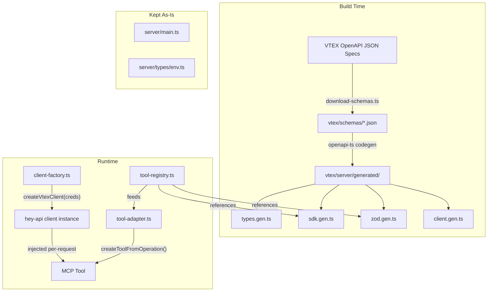

# VTEX MCP Migration to Hey API Codegen

## Current State

The `vtex/` MCP has **59 hand-crafted tools** across 55 files, backed by:

- A 618-line `VTEXClient` class ([vtex/server/lib/client.ts](vtex/server/lib/client.ts)) with manual fetch + retry logic
- 4 manually-written type files (296+ lines in [vtex/server/types/](vtex/server/types/))
- Per-tool Zod schemas duplicated across every tool file
- Scripts already scaffolded but unused: [vtex/scripts/download-schemas.ts](vtex/scripts/download-schemas.ts) and [vtex/scripts/generate-client.ts](vtex/scripts/generate-client.ts)
- `@hey-api/openapi-ts@^0.66.1` already in devDependencies (outdated)

## Target Architecture




**Key files that will be created:**

- `vtex/server/lib/client-factory.ts` -- creates a hey-api client with VTEX auth per request
- `vtex/server/lib/tool-adapter.ts` -- generic bridge: generated Zod schema + SDK function -> `createTool()`
- `vtex/server/tools/registry.ts` -- curated list of which operations become MCP tools
- `vtex/openapi-ts.config.ts` -- hey-api codegen configuration

**Key files that will be deleted (after migration):**

- `vtex/server/lib/client.ts` (replaced by generated SDK + client-factory)
- `vtex/server/types/catalog.ts`, `order.ts`, `logistics.ts`, `pricing.ts` (replaced by generated types)
- All 55 files under `vtex/server/tools/` except `index.ts` and `registry.ts`

---

## Phase 1: Schema Infrastructure

### 1a. Update Dependencies

Update `package.json` devDependencies:

```json
"@hey-api/openapi-ts": "0.92.4",
"@hey-api/client-fetch": "^0.8.0"
```

The `@hey-api/client-fetch` is already correct. Pin `openapi-ts` to exact version (0.x semver, breaking changes between minors).

### 1b. Expand Schema Downloads

Update [vtex/scripts/download-schemas.ts](vtex/scripts/download-schemas.ts) to download all VTEX APIs that the current MCP covers, plus a few high-value additions:

```typescript
const SCHEMAS = [
  { name: "catalog", file: "VTEX - Catalog API.json" },
  { name: "orders", file: "VTEX - Orders API.json" },
  { name: "logistics", file: "VTEX - Logistics API.json" },
  { name: "pricing", file: "VTEX - Pricing API.json" },
  { name: "search", file: "VTEX - Intelligent Search API.json" },
  { name: "checkout", file: "VTEX - Checkout API.json" },
  { name: "promotions", file: "VTEX - Promotions & Taxes API.json" },
];
```

Base URL pattern: `https://raw.githubusercontent.com/vtex/openapi-schemas/master/VTEX%20-%20{name}.json`

Add validation: after downloading, parse each file as JSON and verify it has `openapi` and `paths` keys.

### 1c. Download Schemas

Run `bun run download-schemas` to populate `vtex/schemas/` directory.

---

## Phase 2: Code Generation

### 2a. Create Codegen Config

Create `vtex/openapi-ts.config.ts`:

```typescript
import { defineConfig } from "@hey-api/openapi-ts";

const APIS = ["catalog", "orders", "logistics", "pricing", "search", "checkout", "promotions"];

const sharedPlugins = [
  "@hey-api/client-fetch",
  "@hey-api/typescript",
  {
    name: "zod",
    requests: true,
    responses: false,     // skip response schemas to keep size down
    definitions: true,
    metadata: true,
  },
  {
    name: "@hey-api/sdk",
    validator: false,     // we validate manually in the adapter
  },
];

export default APIS.map((api) => ({
  input: `./schemas/${api}.json`,
  output: `./server/generated/${api}`,
  plugins: sharedPlugins,
  parser: {
    filters: { deprecated: false },
  },
}));
```

Key decisions:

- `responses: false` -- MCP tools return raw JSON; generating response Zod schemas for all endpoints would add 50K+ lines of code for minimal benefit
- `definitions: true` -- reusable component schemas, useful for documentation
- `validator: false` on SDK -- we handle validation in the tool adapter layer
- One output dir per API to keep generated code modular

### 2b. Update package.json Scripts

```json
"scripts": {
  "download-schemas": "bun run scripts/download-schemas.ts",
  "openapi": "openapi-ts",
  "generate": "bun run download-schemas && bun run openapi",
  "dev": "bun run --hot server/main.ts",
  "check": "tsc --noEmit"
}
```

### 2c. Run Generation and Validate

Run `bun run generate`. The output lands in `vtex/server/generated/` (already excluded from tsconfig via `"exclude": ["server/generated"]`).

Verify: `ls vtex/server/generated/catalog/` should show `types.gen.ts`, `sdk.gen.ts`, `zod.gen.ts`, `client.gen.ts`.

**Potential issue:** Some VTEX schemas have operationId inconsistencies or missing ids. If codegen fails, use `parser.patch` in the config to fix them.

---

## Phase 3: Tool Adapter Bridge

This is the core engineering work. Three new files:

### 3a. Client Factory (`vtex/server/lib/client-factory.ts`)

Replaces the 618-line `VTEXClient` class with a thin factory:

```typescript
import { createClient } from "../generated/catalog/client.gen";
import type { VTEXCredentials } from "../types/env";

export function createVtexClient(credentials: VTEXCredentials) {
  const client = createClient({
    baseUrl: `https://${credentials.accountName}.vtexcommercestable.com.br`,
  });

  client.interceptors.request.use((request) => {
    if (credentials.appKey) {
      request.headers.set("X-VTEX-API-AppKey", credentials.appKey);
    }
    if (credentials.appToken) {
      request.headers.set("X-VTEX-API-AppToken", credentials.appToken);
    }
    return request;
  });

  return client;
}
```

All retry logic that currently lives in `VTEXClient.request()` should be moved into a response interceptor on this client, so it applies uniformly to all SDK calls.

### 3b. Tool Adapter (`vtex/server/lib/tool-adapter.ts`)

Generic function that converts a generated Zod request schema + SDK function into a `createTool` definition:

```typescript
import { createTool } from "@decocms/runtime/tools";
import { z } from "zod";
import type { Env } from "../types/env";
import { createVtexClient } from "./client-factory";

interface ToolFromOperationConfig {
  id: string;
  description: string;
  requestSchema: z.ZodObject<Record<string, z.ZodTypeAny>>;
  sdkFn: (options: Record<string, unknown>) => Promise<{ data?: unknown; error?: unknown }>;
}

export function createToolFromOperation(config: ToolFromOperationConfig) {
  const flatInput = flattenRequestSchema(config.requestSchema);

  return (env: Env) =>
    createTool({
      id: config.id,
      description: config.description,
      inputSchema: flatInput,
      execute: async ({ context }) => {
        const creds = env.MESH_REQUEST_CONTEXT.state;
        const client = createVtexClient(creds);
        const structured = unflattenToStructured(context, config.requestSchema);
        const result = await config.sdkFn({ ...structured, client });
        if (result.error) throw new Error(JSON.stringify(result.error));
        return JSON.stringify(result.data, null, 2);
      },
    });
}
```

The `flattenRequestSchema` helper merges `.shape.path`, `.shape.query`, and `.shape.body` into one flat `z.object`. The `unflattenToStructured` reverses it when calling the SDK.

**Flattening strategy:**

- Path params (e.g., `productId`) and query params are promoted to top-level
- Body params: for simple bodies, also promoted to top-level; for complex/nested bodies, kept under a `body` key
- Descriptions from the OpenAPI spec carry through via `metadata: true` in the Zod plugin

### 3c. Tool Registry (`vtex/server/tools/registry.ts`)

A curated mapping of which generated operations become MCP tools:

```typescript
import * as catalogZod from "../generated/catalog/zod.gen";
import * as catalogSdk from "../generated/catalog/sdk.gen";
import { createToolFromOperation } from "../lib/tool-adapter";

export const catalogTools = [
  createToolFromOperation({
    id: "VTEX_GET_PRODUCT",
    description: "Get a product by its ID. Returns product details including name, description, category, brand, and status.",
    requestSchema: catalogZod.zGetProductbyidData,
    sdkFn: catalogSdk.getProductbyid,
  }),
  createToolFromOperation({
    id: "VTEX_LIST_PRODUCTS",
    description: "List product and SKU IDs with pagination.",
    requestSchema: catalogZod.zProductAndSkuIdsData,
    sdkFn: catalogSdk.productAndSkuIds,
  }),
  // ... ~50-80 curated endpoints
];
```

Adding a new tool = one entry in this file. No manual Zod schemas, no manual client methods, no manual type definitions.

### 3d. Manual Overrides

Some tools need custom logic that the adapter cannot provide. For example, `searchProductsPublic` builds `fq` filter strings from structured params. These stay as hand-written tools in a `vtex/server/tools/custom/` directory, but they use the generated SDK client instead of `VTEXClient`:

```typescript
// vtex/server/tools/custom/search-public.ts
import { createTool } from "@decocms/runtime/tools";
import { z } from "zod";
import { createVtexClient } from "../../lib/client-factory";
// Uses generated SDK function directly
import { searchProducts } from "../../generated/catalog/sdk.gen";
```

---

## Phase 4: Incremental Migration

Migrate one domain at a time, running the existing tests between each step.

### Migration order (simplest to hardest):

1. **Brand** (3 tools, simple CRUD, no custom logic)
2. **Category** (3 tools, simple CRUD)
3. **Warehouse** (2 tools, read-only)
4. **Inventory** (2 tools, get + update)
5. **Price** (7 tools, straightforward CRUD)
6. **Product** (9 tools -- `search-public` and `get-suggestions-public` need manual override)
7. **SKU** (6 tools -- `get-with-images` has parallel fetch logic, needs manual override)
8. **Order** (5 tools, `list` has 15+ filter params)
9. **Collection** (9 tools, bulk operations need manual override)

For each domain:

1. Add entries to `registry.ts` using generated artifacts
2. Verify the generated inputSchema matches the old manual one (field names, types, optionality)
3. Swap the import in `tools/index.ts` from manual to generated
4. Delete the old manual tool files
5. Run tests

### Keep `tools/index.ts` as the single export point

```typescript
// After migration
import { catalogTools } from "./registry";
import { orderTools } from "./registry";
// ...
import { searchProductsPublic } from "./custom/search-public";

export const tools = [
  ...catalogTools,
  ...orderTools,
  // ...
  searchProductsPublic,  // manual override
];
```

---

## Phase 5: Cleanup

After all domains are migrated:

1. Delete `vtex/server/lib/client.ts` (the old VTEXClient)
2. Delete `vtex/server/types/catalog.ts`, `order.ts`, `logistics.ts`, `pricing.ts` (replaced by generated types)
3. Delete all old tool files from `vtex/server/tools/{domain}/` directories
4. Update `vtex/server/types/index.ts` to only export `env.ts`
5. Run `bun run fmt && bun run lint && bun run check` to verify

---

## Phase 6: Testing Strategy

### 6a. Unit Tests for the Adapter

File: `vtex/tests/tool-adapter.test.ts`

Test the `flattenRequestSchema` and `unflattenToStructured` functions:

```typescript
import { describe, it, expect } from "bun:test";
import { z } from "zod";
import { flattenRequestSchema, unflattenToStructured } from "../server/lib/tool-adapter";

describe("flattenRequestSchema", () => {
  it("merges path and query into flat schema", () => {
    const schema = z.object({
      path: z.object({ productId: z.number() }),
      query: z.object({ from: z.number().optional() }).optional(),
      body: z.never().optional(),
    });
    const flat = flattenRequestSchema(schema);
    // Should have productId and from as top-level keys
  });

  it("handles body-only POST schemas", () => { /* ... */ });
  it("handles name collisions by prefixing", () => { /* ... */ });
});

describe("unflattenToStructured", () => {
  it("reconstructs body/path/query from flat input", () => { /* ... */ });
});
```

### 6b. Schema Parity Tests

Verify that the generated Zod schemas are compatible with the old manual ones. For each migrated tool, test that the same input accepted by the old schema is accepted by the new flattened schema:

```typescript
describe("schema parity", () => {
  it("VTEX_GET_PRODUCT accepts same input shape", () => {
    const input = { productId: 123 };
    // Old schema
    const oldResult = oldGetProductInputSchema.safeParse(input);
    // New generated + flattened schema
    const newResult = newGetProductInputSchema.safeParse(input);
    expect(oldResult.success).toBe(newResult.success);
  });
});
```

### 6c. Integration Smoke Tests (with mock server)

File: `vtex/tests/integration.test.ts`

Use `bun:test` with a mock HTTP server to verify the full chain:

```typescript
import { describe, it, expect, beforeAll, afterAll } from "bun:test";

describe("generated tool integration", () => {
  let mockServer: ReturnType<typeof Bun.serve>;

  beforeAll(() => {
    mockServer = Bun.serve({
      port: 0,
      fetch(req) {
        const url = new URL(req.url);
        if (url.pathname === "/api/catalog/pvt/product/123") {
          return Response.json({ Id: 123, Name: "Test Product", /* ... */ });
        }
        return new Response("Not found", { status: 404 });
      },
    });
  });

  afterAll(() => mockServer.stop());

  it("VTEX_GET_PRODUCT calls correct endpoint and returns data", async () => {
    // Override baseUrl to point to mock server
    // Execute the tool
    // Verify response matches expected shape
  });
});
```

### 6d. Manual Validation

For final validation, test against a real VTEX sandbox account:

1. Configure the MCP with real credentials
2. Exercise each tool via the MCP inspector or Cursor
3. Compare responses with the old implementation

---

## Risk Mitigations


| Risk                                        | Mitigation                                                              |
| ------------------------------------------- | ----------------------------------------------------------------------- |
| VTEX schema has missing/bad operationId     | Use `parser.patch` in config or `methodNameBuilder` on SDK plugin       |
| Generated Zod schema too verbose for LLM    | Keep `responses: false`; only generate input schemas                    |
| Codegen fails on complex anyOf/polymorphism | Download and pre-process schemas with a sanitize step                   |
| Breaking change in hey-api 0.x              | Pin exact version in package.json                                       |
| Some endpoints need custom logic            | `custom/` directory for manual overrides, coexists with generated tools |
| Generated SDK names don't match tool IDs    | Registry file explicitly maps generated names to stable tool IDs        |


