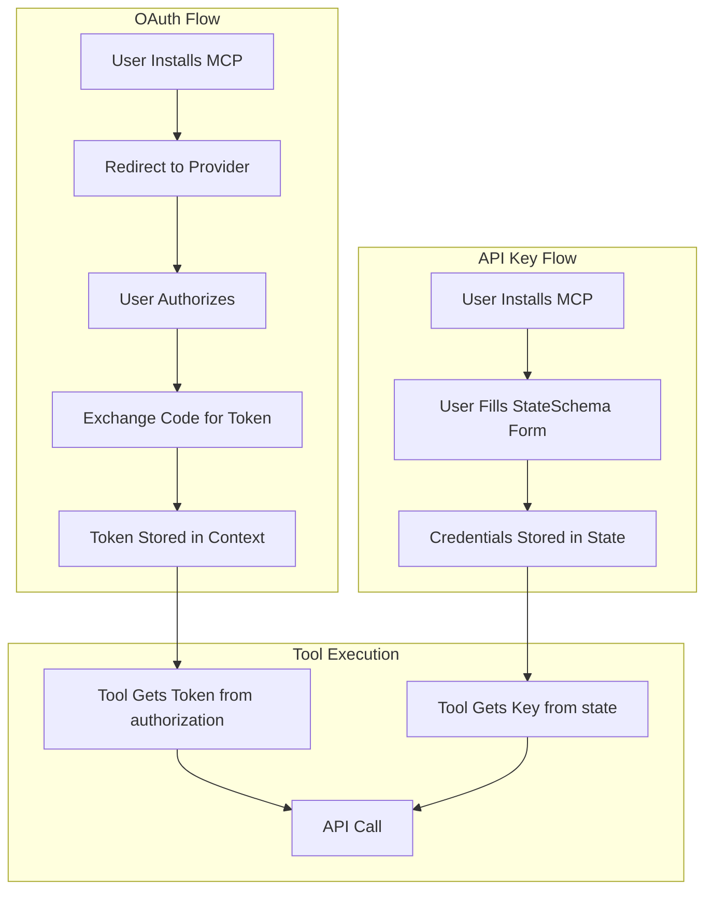

# MCP Server Creation Guide

This guide explains how to create MCP (Model Context Protocol) servers with different authentication patterns.

## Table of Contents

- [Quick Start](#quick-start)
- [Directory Structure](#directory-structure)
- [Basic Configuration](#basic-configuration)
- [Authentication Patterns](#authentication-patterns)
  - [Without OAuth (API Key / Token)](#without-oauth-api-key--token)
  - [With OAuth](#with-oauth)
- [Creating Tools](#creating-tools)
- [Registry Configuration (app.json)](#registry-configuration-appjson)
- [Adding to Workspaces](#adding-to-workspaces)
- [Deployment](#deployment)
- [Examples](#examples)

---

## Quick Start

```bash
bun scripts/new.ts <mcp-name>
```

**Options:**
- `--no-view` - Create MCP without web interface (API only)
- `--template minimal` - Use minimal template
- `--description "Description"` - Set custom description

---

## Directory Structure

```
my-mcp/
├── server/
│   ├── main.ts              # Entry point
│   ├── constants.ts         # Constants and configuration
│   ├── tools/
│   │   ├── index.ts         # Export all tools
│   │   └── my-tool.ts       # Tool implementations
│   └── lib/                 # External clients and utilities
│       ├── client.ts        # API client
│       ├── env.ts           # Environment helpers
│       └── types.ts         # Type definitions
├── shared/
│   └── deco.gen.ts          # Auto-generated types
├── app.json                 # Registry metadata
├── package.json
├── tsconfig.json
└── README.md
```

---

## Basic Configuration

### package.json

```json
{
  "name": "my-mcp",
  "version": "1.0.0",
  "description": "My MCP Server description",
  "private": true,
  "type": "module",
  "scripts": {
    "dev": "bun run --hot server/main.ts",
    "build:server": "NODE_ENV=production bun build server/main.ts --target=bun --outfile=dist/server/main.js",
    "build": "bun run build:server",
    "publish": "cat app.json | deco registry publish -w /shared/deco -y",
    "check": "tsc --noEmit"
  },
  "dependencies": {
    "@decocms/runtime": "^1.1.3",
    "zod": "^4.0.0"
  },
  "devDependencies": {
    "@decocms/mcps-shared": "workspace:*",
    "@modelcontextprotocol/sdk": "1.25.1",
    "deco-cli": "^0.28.0",
    "typescript": "^5.7.2"
  },
  "engines": {
    "node": ">=22.0.0"
  }
}
```

### tsconfig.json

```json
{
  "compilerOptions": {
    "target": "ESNext",
    "module": "ESNext",
    "moduleResolution": "bundler",
    "strict": true,
    "skipLibCheck": true,
    "declaration": true,
    "esModuleInterop": true,
    "resolveJsonModule": true,
    "isolatedModules": true,
    "noEmit": true,
    "lib": ["ESNext"],
    "types": ["bun-types"],
    "baseUrl": ".",
    "paths": {
      "server/*": ["./server/*"],
      "shared/*": ["./shared/*"]
    }
  },
  "include": ["server/**/*", "shared/**/*"],
  "exclude": ["node_modules", "dist"]
}
```

---

## Authentication Patterns



### Without OAuth (API Key / Token)

Use this pattern when your MCP requires API keys, tokens, or other credentials that users provide during installation.

**Example:** Meta Ads, Perplexity, Pinecone

#### server/main.ts

```typescript
import { z } from "zod";
import { withRuntime } from "@decocms/runtime";
import { serve } from "@decocms/mcps-shared/serve";
import {
  type Env as DecoEnv,
  StateSchema as BaseStateSchema,
} from "../shared/deco.gen.ts";
import { tools } from "./tools/index.ts";

/**
 * State schema defines fields users fill when installing the MCP.
 * These values are accessible in tools via env.MESH_REQUEST_CONTEXT?.state
 */
export const StateSchema = BaseStateSchema.extend({
  API_KEY: z
    .string()
    .describe("Your API Key - obtain from https://example.com/api-keys"),
  
  // Optional fields
  API_SECRET: z
    .string()
    .optional()
    .describe("Optional: API Secret for enhanced features"),
});

export type Env = DecoEnv & {
  MESH_REQUEST_CONTEXT?: {
    state: {
      API_KEY?: string;
      API_SECRET?: string;
    };
  };
};

const runtime = withRuntime<Env, typeof StateSchema>({
  configuration: {
    scopes: [],
    state: StateSchema,
  },
  tools,
});

serve(runtime.fetch);
```

#### server/lib/env.ts

```typescript
import type { Env } from "../main.ts";

/**
 * Get API key from request context state or environment variables.
 */
export const getApiKey = (env: Env): string => {
  const context = env.MESH_REQUEST_CONTEXT;
  const state = context?.state;

  let apiKey = state?.API_KEY;

  // Fallback to environment variables for development
  if (typeof process !== "undefined" && process.env) {
    if (!apiKey) apiKey = process.env.API_KEY;
  }

  if (!apiKey) {
    throw new Error(
      "API_KEY is required. Please configure it in the MCP settings."
    );
  }

  return apiKey;
};
```

---

### With OAuth

Use this pattern when integrating with services that support OAuth (Google, OpenRouter, etc.).

**Example:** Google Drive, Google Sheets, OpenRouter

#### server/main.ts (Google OAuth)

```typescript
import { withRuntime } from "@decocms/runtime";
import { serve } from "@decocms/mcps-shared/serve";
import { tools } from "./tools/index.ts";
import type { Env } from "../shared/deco.gen.ts";

export type { Env };

// Define required OAuth scopes
const SCOPES = [
  "https://www.googleapis.com/auth/drive",
  "https://www.googleapis.com/auth/drive.file",
].join(" ");

let lastRedirectUri: string | null = null;

const runtime = withRuntime<Env>({
  tools: (env: Env) => tools.map((createTool) => createTool(env)),
  oauth: {
    mode: "PKCE",
    authorizationServer: "https://accounts.google.com",
    
    /**
     * Build the authorization URL to redirect users to Google.
     */
    authorizationUrl: (callbackUrl) => {
      const callbackUrlObj = new URL(callbackUrl);
      const state = callbackUrlObj.searchParams.get("state");
      callbackUrlObj.searchParams.delete("state");
      const cleanRedirectUri = callbackUrlObj.toString();
      lastRedirectUri = cleanRedirectUri;

      const url = new URL("https://accounts.google.com/o/oauth2/v2/auth");
      url.searchParams.set("redirect_uri", cleanRedirectUri);
      url.searchParams.set("client_id", process.env.GOOGLE_CLIENT_ID!);
      url.searchParams.set("response_type", "code");
      url.searchParams.set("scope", SCOPES);
      url.searchParams.set("access_type", "offline");
      url.searchParams.set("prompt", "consent");
      if (state) url.searchParams.set("state", state);
      return url.toString();
    },
    
    /**
     * Exchange authorization code for access token.
     */
    exchangeCode: async ({ code, code_verifier }: any) => {
      if (!lastRedirectUri) {
        throw new Error("redirect_uri is required for OAuth token exchange");
      }
      
      const params = new URLSearchParams({
        code,
        client_id: process.env.GOOGLE_CLIENT_ID!,
        client_secret: process.env.GOOGLE_CLIENT_SECRET!,
        grant_type: "authorization_code",
        redirect_uri: lastRedirectUri,
      });
      if (code_verifier) params.set("code_verifier", code_verifier);

      const response = await fetch("https://oauth2.googleapis.com/token", {
        method: "POST",
        headers: { "Content-Type": "application/x-www-form-urlencoded" },
        body: params,
      });
      
      if (!response.ok) {
        const error = await response.text();
        throw new Error(`OAuth failed: ${response.status} - ${error}`);
      }
      
      const data = (await response.json()) as any;
      return {
        access_token: data.access_token,
        refresh_token: data.refresh_token,
        token_type: data.token_type || "Bearer",
        expires_in: data.expires_in,
      };
    },
  },
});

serve(runtime.fetch);
```

#### server/main.ts (Simple OAuth - OpenRouter style)

```typescript
import { withRuntime } from "@decocms/runtime";
import { serve } from "@decocms/mcps-shared/serve";
import { z } from "zod";
import { tools } from "./tools/index.ts";

const StateSchema = z.object({});

export type Env = DefaultEnv<typeof StateSchema>;

const runtime = withRuntime<Env, typeof StateSchema>({
  oauth: {
    mode: "PKCE",
    authorizationServer: "https://openrouter.ai",
    
    authorizationUrl: (callbackUrl) => {
      const url = new URL("https://openrouter.ai/auth");
      url.searchParams.set("callback_url", callbackUrl);
      return url.toString();
    },
    
    exchangeCode: async ({ code, code_verifier, code_challenge_method }) => {
      const response = await fetch("https://openrouter.ai/api/v1/auth/keys", {
        method: "POST",
        headers: { "Content-Type": "application/json" },
        body: JSON.stringify({ code, code_verifier, code_challenge_method }),
      });

      if (!response.ok) {
        throw new Error(`Auth failed: ${response.status}`);
      }

      const { key } = (await response.json()) as { key: string };
      return {
        access_token: key,
        token_type: "Bearer",
      };
    },
  },
  tools,
  prompts: [],
});

serve(runtime.fetch);
```

#### server/lib/env.ts (OAuth)

```typescript
import type { Env } from "../../shared/deco.gen.ts";

/**
 * Get OAuth access token from request context.
 */
export const getAccessToken = (env: Env): string => {
  const authorization = env.MESH_REQUEST_CONTEXT?.authorization;
  if (!authorization) {
    throw new Error(
      "Not authenticated. Please authorize first."
    );
  }
  // Remove "Bearer " prefix if present
  return authorization.replace(/^Bearer\s+/i, "");
};
```

---

## Creating Tools

Tools are the core functionality of your MCP. Use `createPrivateTool` from `@decocms/runtime/tools`.

### Basic Tool Structure

```typescript
import { createPrivateTool } from "@decocms/runtime/tools";
import { z } from "zod";
import type { Env } from "../main.ts";
import { getApiKey } from "../lib/env.ts";
import { MyApiClient } from "../lib/client.ts";

export const createMyTool = (env: Env) =>
  createPrivateTool({
    id: "my_tool_id",
    description: "What this tool does. Be descriptive for AI agents.",
    
    inputSchema: z.object({
      required_param: z.string().describe("Description of this parameter"),
      optional_param: z.coerce
        .number()
        .optional()
        .default(10)
        .describe("Optional parameter with default"),
    }),
    
    outputSchema: z.object({
      result: z.string(),
      count: z.number(),
    }),
    
    execute: async ({ context }) => {
      const client = new MyApiClient({ apiKey: getApiKey(env) });
      
      const result = await client.doSomething({
        param: context.required_param,
        limit: context.optional_param,
      });
      
      return {
        result: result.data,
        count: result.total,
      };
    },
  });
```

### tools/index.ts

```typescript
import { createMyTool } from "./my-tool.ts";
import { createAnotherTool } from "./another-tool.ts";

// For OAuth MCPs (tools receive env)
export const tools = [
  createMyTool,
  createAnotherTool,
];

// Or for simpler exports
export { createMyTool, createAnotherTool };
```

---

## Registry Configuration (app.json)

The `app.json` file defines how your MCP appears in the registry.

```json
{
  "scopeName": "deco",
  "name": "my-mcp",
  "friendlyName": "My MCP Name",
  "connection": {
    "type": "HTTP",
    "url": "https://sites-my-mcp.decocache.com/mcp"
  },
  "description": "Short description of what this MCP does.",
  "icon": "https://example.com/icon.png",
  "unlisted": false,
  "metadata": {
    "categories": ["AI", "Productivity"],
    "official": false,
    "tags": ["keyword1", "keyword2", "keyword3"],
    "short_description": "Same as description field.",
    "mesh_description": "Detailed description for AI agents explaining capabilities, use cases, and integration scenarios. This helps AI understand when and how to use this MCP."
  }
}
```

### Categories

Common categories:
- `AI` - AI/ML related tools
- `Productivity` - Productivity and workflow tools
- `Marketing` - Marketing and advertising
- `Developer Tools` - Development utilities
- `Storage` - File and data storage
- `Communication` - Email, chat, messaging

---

## Adding to Workspaces

After creating your MCP, add it to the root `package.json` workspaces array:

```json
{
  "workspaces": [
    "apify",
    "my-mcp",  // Add your MCP here
    "shared",
    ...
  ]
}
```

Then run:

```bash
bun install
```

---

## Deployment

### Local Development

```bash
cd my-mcp
bun install
bun run dev
```

### Environment Variables

For OAuth MCPs (Google example), you need:
- `GOOGLE_CLIENT_ID` - OAuth client ID
- `GOOGLE_CLIENT_SECRET` - OAuth client secret

For API Key MCPs, users provide credentials during installation.

### GitHub Secrets

Add required secrets to GitHub for CI/CD:
1. Go to Repository > Settings > Secrets and variables > Actions
2. Add secrets like `GOOGLE_CLIENT_ID`, `GOOGLE_CLIENT_SECRET`

### Deploy

```bash
bun run build
# Deployment is handled by CI/CD pipeline
```

---

## Examples

### OAuth-based MCPs
- `google-drive/` - Google Drive integration
- `google-sheets/` - Google Sheets integration
- `google-gmail/` - Gmail integration
- `google-calendar/` - Google Calendar integration
- `openrouter/` - OpenRouter AI models

### API Key-based MCPs
- `meta-ads/` - Meta/Facebook Ads
- `perplexity/` - Perplexity AI search
- `pinecone/` - Pinecone vector database
- `replicate/` - Replicate AI models

### Minimal Template
- `template-minimal/` - Basic MCP without web interface

---

## Shared Utilities

The `/shared` directory contains reusable utilities:

```typescript
// Import shared utilities
import { serve } from "@decocms/mcps-shared/serve";
import { userTools } from "@decocms/mcps-shared/tools/user";
```

Always check `/shared` before implementing common functionality to avoid code duplication.

---

## Troubleshooting

### Common Issues

1. **Workspace dependency not found**
   - Ensure your MCP is added to root `package.json` workspaces
   - Run `bun install` from the root directory

2. **OAuth token not available**
   - Check that `env.MESH_REQUEST_CONTEXT?.authorization` is properly set
   - Verify OAuth configuration in `main.ts`

3. **State values undefined**
   - Ensure StateSchema fields match what you're accessing
   - Check `env.MESH_REQUEST_CONTEXT?.state` structure

4. **Build errors**
   - Run `bun run check` to verify TypeScript types
   - Ensure all dependencies are installed

