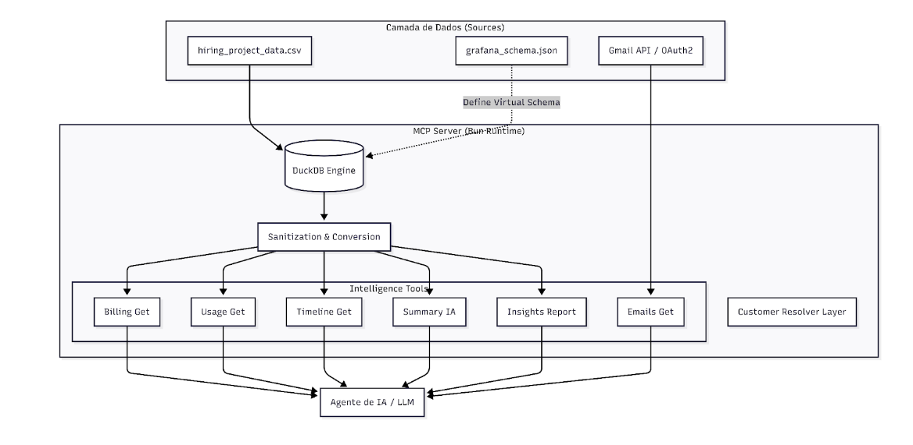
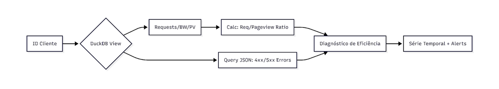
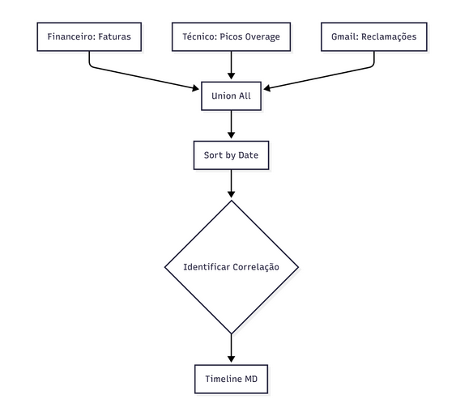
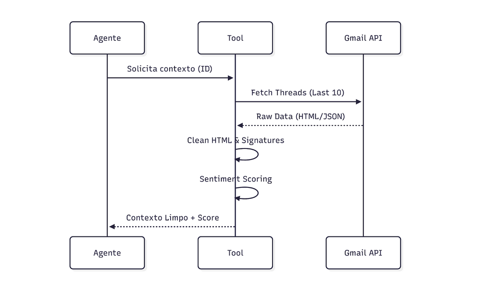
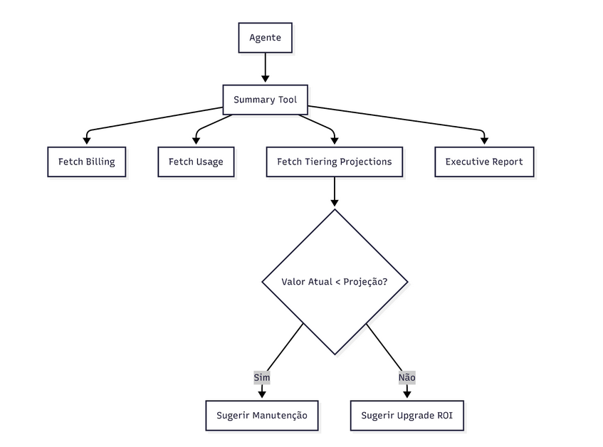

# Customer Insights MCP

Servidor MCP que fornece contexto financeiro e operacional instantaneo sobre clientes para o time. Quando um cliente reclama de fatura, o agente consulta as tools deste servidor e monta uma resposta completa em segundos.

## O que faz



O servidor expoe 10 tools que um agente de IA (Claude, GPT, etc.) pode chamar:

| Tool | O que retorna |
|------|---------------|
| `upload_csv` | Faz upload de CSV (billing ou contacts) e recarrega os dados sem reiniciar |
| `customer_billing_get` | Historico de faturas, status de pagamento, DSO, overage, alerta de margem |
| `customer_usage_get` | Pageviews, requests, bandwidth com tendencia e deteccao de anomalias |
| `customer_timeline_get` | Linha do tempo unificada (faturas + uso + emails) em ordem cronologica |
| `customer_emails_get` | Emails do cliente via Gmail (OAuth) com filtros por assunto e data |
| `customer_summary_generate` | Gera e salva snapshot de resumo executivo (operacao pesada, ~3-5s) |
| `customer_summary_get` | Retorna snapshot salvo instantaneamente ou gera on-the-fly se nao existir |
| `customer_invoice_explain` | Breakdown detalhado de uma fatura especifica com comparacao ao mes anterior |
| `customer_health_list` | Lista todos os clientes ranqueados por health score (0-100) |
| `customer_risk_score` | Score de risco de churn (0-10) com 5 fatores ponderados |

## Stack

- **TypeScript** + **Bun** runtime
- **DuckDB** (in-memory) para queries SQL sobre CSVs
- **@decocms/runtime** como framework MCP
- **Gmail API** (OAuth2, scope `gmail.readonly`) para emails
- **LLM opcional** (OpenAI, Anthropic, Gemini, DeepSeek, Groq) para enriquecer o summary
- **Zod** para validacao de input/output em todas as tools

## Estrutura do projeto

```
customer-insights/
  server/
    main.ts              # Entry point — inicia DuckDB, registra tools, sobe servidor
    db.ts                # Camada DuckDB — views, snapshots, CRUD
    data/                # CSVs uploadados (criado automaticamente)
    tools/
      index.ts           # Registro das 10 tools
      upload-csv.ts      # upload_csv
      billing.ts         # customer_billing_get
      usage.ts           # customer_usage_get
      timeline.ts        # customer_timeline_get
      emails.ts          # customer_emails_get
      summary.ts         # customer_summary_get + funcoes compartilhadas de analise
      summary-generate.ts # customer_summary_generate (gera e salva snapshot)
      invoice-explainer.ts # customer_invoice_explain
      health-list.ts     # customer_health_list
      risk-score.ts      # customer_risk_score
      customer-resolver.ts  # Resolve cliente por ID, nome ou dominio de email
      sanitize.ts        # Converte BigInt/Date para tipos JSON-safe
    types/
      env.ts             # Tipos de ambiente e schema de state (LLM_CONFIG)
    __tests__/           # Arquivos de teste das tools e utilitarios
      sanitize.test.ts
      customer-resolver.test.ts
      db.test.ts
      billing.test.ts
      usage.test.ts
      invoice-explainer.test.ts
      health-list.test.ts
      risk-score.test.ts
      timeline.test.ts
      emails.test.ts
      summary.test.ts
      upload-csv.test.ts
  assets/              # Screenshots das tools em acao
  package.json
```

## Setup

### Pre-requisitos

- Bun instalado (`curl -fsSL https://bun.sh/install | bash`)

### Instalacao

```bash
cd mcps/customer-insights
bun install
```

### Variaveis de ambiente

Crie o arquivo `mcps/customer-insights/.env`:

```env
GOOGLE_CLIENT_ID=seu_client_id
GOOGLE_CLIENT_SECRET=seu_client_secret
```

### Configurar OAuth no Google Cloud

1. Crie um projeto no [Google Cloud Console](https://console.cloud.google.com/)
2. Ative a Gmail API
3. Crie um OAuth Client (tipo **Web application**)
4. Adicione as redirect URIs:
   - `https://sites-customer-insights.decocache.com/oauth/callback`
   - `http://localhost:8001/oauth/callback` (desenvolvimento local)
5. Em "OAuth consent screen", adicione seu usuario em "Test users" enquanto o app estiver em modo Testing

### Rodar

```bash
bun run dev
```

### Build

```bash
bun run build
```

### Testes

```bash
bun run test
```

Suite de testes cobrindo tools + db + sanitize.

## Como funciona

### Fonte de dados

O DuckDB sobe em memoria e cria views SQL a partir de CSVs armazenados em `server/data/`.

- Use a tool `upload_csv` para enviar os CSVs via URL (Google Drive, S3, etc.)
- Os arquivos sao salvos em `server/data/` e o DuckDB recarrega automaticamente
- Se nenhum CSV foi uploadado, as views ficam vazias ate o primeiro upload
- CSVs corrompidos sao detectados e deletados automaticamente na inicializacao

**Views criadas:**
- **`v_billing`** — dados de faturamento (valores BRL parseados automaticamente)
- **`v_customer_contacts`** — contatos dos clientes (id, nome, email)
- **`usage_stats`** — tabela para dados CDN

**Tabela interna:**
- **`summary_snapshots`** — cache de resumos executivos gerados (customer_id como PK, upsert)

Os valores monetarios em BRL sao parseados automaticamente nos dois formatos encontrados nos dados: `R$1.855,92` (virgula decimal) e `R$2783.28` (ponto decimal para tiering).

### Resolucao de cliente

Todas as tools aceitam `customer_id` (numerico, recomendado) ou `customer_name` (texto). O resolver tenta encontrar o cliente e retorna um dos status:

- **`id`** — encontrado por ID direto (mais confiavel, unico)
- **`exact`** — nome bateu exatamente (case-insensitive)
- **`partial`** — um unico resultado parcial
- **`ambiguous`** — multiplos candidatos encontrados (retorna lista com IDs para desambiguacao)
- **`none`** — nenhum cliente encontrado

Tambem suporta busca por dominio de email via `resolveCustomersByDomain` (usado internamente por `customer_emails_get`).

### Sanitizacao

O DuckDB retorna `BigInt` para colunas inteiras e objetos `Date` para colunas de data. O sanitizer converte recursivamente: `BigInt` vira `Number` e `Date` vira string `YYYY-MM-DD`, evitando erros de serializacao JSON.

### Snapshots (Summary)

O sistema de summary usa um modelo generate + get:

1. **`customer_summary_generate`** — Executa a analise completa (billing + usage + emails + tiering + LLM opcional), salva o resultado como snapshot no DuckDB (~3-5s)
2. **`customer_summary_get`** — Busca o snapshot salvo e retorna instantaneamente. Se nao existir snapshot, gera on-the-fly como fallback

Esse modelo evita re-computar a analise a cada consulta.

## Tools em detalhe

### `upload_csv`

Baixa um CSV a partir de uma URL e atualiza os dados do servidor em tempo real.

**Entrada:**
```json
{
  "data_type": "billing",
  "csv_url": "https://drive.google.com/file/d/abc123/view"
}
```

**Tipos aceitos:**
- `billing` — dados de faturamento (faturas, uso, overage, tiering)
- `contacts` — contatos dos clientes (ID, Nome, Email)

**Formato esperado — `billing`:**

```
ID,Vencimento original,Vencimento,Valor,Reference month,Status Account,paid_date,Tipo de serviço,Go-live date (from Subscription),Pageviews considered,Requests considered,BW considered,Extrapageviews price,Extra Req price,ExtraBW price,Number of Seats Builders,Seats Builder Total Cost,Request pageview Ratio,BW/10kPageview ratio,Support Price,Plan (from Subscription),standard 40 reais a cada 10k pageviews + extras,standard 50 reais a cada 10k pageviews + extra,standard 80 reais a cada 10k pageviews + extra
1108,2024-08-16,2024-08-15,"R$1855,92",2024-07-01,paid,2024-08-16,Assinatura da plataforma,29/4/2024,538981,4585756,"179,4","R$1355,92","R$0,00","R$0,00",,,9,3.3,"R$0,00",Standard 40BRL,R$2783.28,R$2918.03,R$4311.85
```

Valores monetários aceitos nos dois formatos: `R$1.855,92` (vírgula decimal) e `R$2783.28` (ponto decimal).

**Formato esperado — `contacts`:**

```
ID,Nome,Email
1108,Paula Piva,paulazpiva@gmail.com
```

**URLs suportadas:**
- Links diretos (S3, presigned URLs, qualquer servidor HTTP)
- Google Drive (links de compartilhamento — converte automaticamente para download)

**O que retorna:**
- Confirmacao de sucesso
- Caminho do arquivo salvo
- Quantidade de linhas carregadas

O DuckDB recarrega a view automaticamente. Nao precisa reiniciar o servidor.

---

### `customer_billing_get`


Retorna o historico completo de faturas com metricas financeiras avancadas.

**Entrada:**
```json
{
  "customer_id": "1108"
}
```

**O que retorna:**
- Lista de faturas com data, valor, status e mes referencia
- Total faturado, total pago, total em atraso
- Media mensal (MRR)
- DSO medio (dias entre vencimento e pagamento)
- Dias desde o ultimo pagamento
- Breakdown de overage (pageviews extras, requests extras, bandwidth extra)
- Custo de seats/builders e suporte
- Alerta de sangramento de margem (quando overage > 40% do total)

---

### `customer_usage_get`



Retorna dados de consumo tecnico com tendencia e alertas automaticos.

**Entrada:**
```json
{
  "customer_id": "1108",
  "months": 12
}
```

**O que retorna:**
- Historico mensal: pageviews, requests, bandwidth, plano
- Ratios de eficiencia: Request/Pageview e BW/10kPageview
- Tendencia: media dos 3 meses recentes vs 3 anteriores com variacao percentual
- Deteccao automatica de anomalias:
  - Alto ratio de requests (possivel bot ou cache mal configurado)
  - Assets pesados (bandwidth subindo sem aumento de pageviews)
  - Queda brusca de uso (possivel churn)
  - Pico de uso (possivel campanha ou viral)

---

### `customer_timeline_get`



Monta uma linha do tempo unificada cruzando tres fontes de dados.

**Entrada:**
```json
{
  "customer_id": "1108",
  "include_emails": true,
  "order": "desc"
}
```

**Fontes combinadas:**
- **Billing** — vencimentos e pagamentos de faturas
- **Usage** — fechamentos mensais e picos de consumo
- **Gmail** — emails do cliente classificados por severidade (info, warning, critical)

A correlacao causa-efeito fica visivel: um pico de erros seguido de email de reclamacao seguido de fatura nao paga.

---

### `customer_emails_get`



Busca emails do cliente diretamente do Gmail via OAuth. Suporta busca por dominio de email para clientes corporativos.

**Entrada:**
```json
{
  "customer_name": "Paula Piva",
  "max_results": 10
}
```

**O que retorna:**
- Dados do cliente encontrado
- Tipo de match (exact, partial, ambiguous)
- Lista de mensagens com subject, from, to, date e snippet
- Busca por dominio: se `email_domain` for fornecido, busca todos os contatos do dominio

Requer login com Google OAuth.

---

### `customer_summary_generate`

Gera e salva um snapshot de resumo executivo completo. Esta e a operacao pesada (~3-5s).

**Entrada:**
```json
{
  "customer_id": "1108",
  "billing_status": "paid",
  "include_email_history": true,
  "email_max_results": 5
}
```

**O que faz:**
1. Resolve o cliente
2. Busca billing, usage, emails e tiering em paralelo
3. Gera analise programatica (status, metricas, recomendacoes)
4. Enriquece com LLM se configurado
5. Salva snapshot no DuckDB (tabela `summary_snapshots`)

**O que retorna:**
- `snapshot_saved: true`
- `customer_id`, `generated_at`
- Resumo formatado completo
- `data_sources` com todos os dados brutos
- `_meta` com info do LLM (se usado)

---

### `customer_summary_get`



Retorna o resumo executivo de um cliente. Busca snapshot salvo primeiro, gera on-the-fly se nao existir.

**Entrada:**
```json
{
  "customer_id": "1108",
  "force_refresh": false
}
```

**O que retorna:**
- Status do cliente (OK, Atencao, Critico)
- Resumo de billing com totais e status
- Tendencia de uso com variacao percentual
- Analise de tiering (se existe plano mais barato)
- Recomendacao de acao
- Dados brutos usados na analise (`data_sources`)

**Funciona sem LLM**: gera analise programatica completa. Se `LLM_CONFIG` estiver configurado, enriquece com IA.

### Configurar LLM (opcional)

No state do MCP, adicione:

```json
{
  "LLM_CONFIG": {
    "provider": "openai",
    "api_key": "sk-...",
    "model": "gpt-4o-mini",
    "max_tokens": 1500
  }
}
```

Providers aceitos: `openai`, `anthropic`, `gemini`, `deepseek`, `groq`.

---

### `customer_invoice_explain`

Breakdown detalhado de uma fatura especifica para um determinado mes.

**Entrada:**
```json
{
  "customer_id": "1108",
  "month": "2025-11"
}
```

**O que retorna:**
- Custo base do plano vs cada categoria extra (pageviews, requests, bandwidth, seats, suporte)
- Percentual de extras sobre o total
- Comparacao com o mes anterior (variacao %)
- Simulacao de tiering (quanto custaria em cada tier)
- Alerta de overdue se houver
- Identificacao do `biggest_driver` (qual extra mais impacta)

---

### `customer_health_list`

Lista todos os clientes ranqueados por um health score computado (0-100).

**Entrada:**
```json
{
  "health_filter": "at_risk",
  "sort_by": "health_score",
  "limit": 20
}
```

**Score baseado em:**
- Taxa de pagamento (invoices pagas / total)
- Quantidade de overdue
- Tendencia de uso (pageviews recentes vs anteriores)
- Percentual de overage

**Labels:** `excellent` (90+) / `healthy` (70-89) / `needs_attention` (50-69) / `at_risk` (30-49) / `critical` (<30)

Cada cliente inclui uma lista de `issues` especificos (ex: "5 invoices overdue", "pageviews dropped 30%").

---

### `customer_risk_score`

Score de risco de churn (0-10) com 5 fatores ponderados para um cliente especifico.

**Entrada:**
```json
{
  "customer_id": "1108"
}
```

**Fatores e pesos:**

| Fator | Peso | O que mede |
|-------|------|------------|
| Payment delay | 0.30 | Media de dias entre vencimento e pagamento |
| Usage trend | 0.20 | Variacao de pageviews (3 meses recentes vs anteriores) |
| Overdue frequency | 0.20 | % de invoices nao pagas |
| Overage percentage | 0.15 | Custo extra como % do total faturado |
| Tiering gap | 0.15 | Quanto a mais o cliente paga vs tier mais barato |

**Retorna:** `risk_score`, `risk_profile` (stable/moderate/elevated/high/critical), breakdown de cada fator, issues detectadas e acoes recomendadas.

---

## Fluxo de atendimento recomendado

Quando um cliente reclama de fatura, o agente segue este fluxo:

```
1. customer_billing_get        → Entende a situacao financeira
2. customer_usage_get          → Valida se o consumo justifica o valor cobrado
3. customer_invoice_explain    → Gera breakdown da fatura em questao
4. customer_timeline_get       → Ve o historico de eventos em ordem
5. customer_emails_get         → Le o contexto das conversas recentes
6. customer_summary_generate   → Gera e salva resumo consolidado
7. customer_summary_get        → Recupera o resumo para resposta
```

O agente cruza esses dados para dar uma resposta precisa. Por exemplo: se o uso subiu 40% mas o plano nao mudou, o agente pode sugerir upgrade. Se ha faturas em atraso mas tambem houve erros tecnicos, o agente sabe que nao deve cobrar de forma agressiva.

Para visao de portfolio:

```
1. customer_health_list        → Quais clientes precisam de atencao hoje?
2. customer_risk_score         → Qual o risco de churn de cada um?
```

## Decisoes de arquitetura

| Decisao | Motivo |
|---------|--------|
| Upload CSV via tool | Em prod nao faz sentido ter CSV hardcoded. Upload dinamico com reload do DuckDB. |
| DuckDB in-memory | Processa CSVs com SQL sem precisar de banco externo. Setup zero. |
| Customer Resolver centralizado | Evita duplicacao de logica de busca. Trata ambiguidade de nome retornando candidatos. Suporta busca por dominio de email. |
| Summary split (generate + get) | Separa operacao pesada (~3-5s) da leitura instantanea. Evita re-computar a cada consulta. |
| Snapshots no DuckDB | Cache de resumos na mesma engine. Upsert por customer_id. Nao precisa de Redis/memcached. |
| Sanitizacao recursiva (BigInt + Date) | DuckDB retorna BigInt e Date nativos. Sanitizer recursivo converte antes do JSON.stringify. |
| OAuth so para Gmail | Separa dados locais (billing/usage) de integracao externa. Minimiza permissoes (readonly). |
| Summary sem LLM obrigatorio | Analise programatica funciona sempre. LLM so enriquece se disponivel. |
| Parsing duplo de BRL | CSVs tem dois formatos de moeda brasileira. O parser aceita ambos. |
| Zod em todas as tools | Validacao de input e output com schemas tipados. Garante contrato entre agente e servidor. |

## Limitacoes conhecidas

- O DuckDB no Bun causa segfault (exit code 3) ao encerrar o processo. Nao afeta o funcionamento — so aparece no shutdown.
- `bun run check` pode falhar por erro de tipagem em `@decocms/runtime` (no `node_modules`), nao no codigo do projeto.
- Bun's `mock.module` e global nos testes — os mocks de um arquivo afetam todos os outros no mesmo run. Os testes contornam isso com estrategias de isolamento documentadas.
